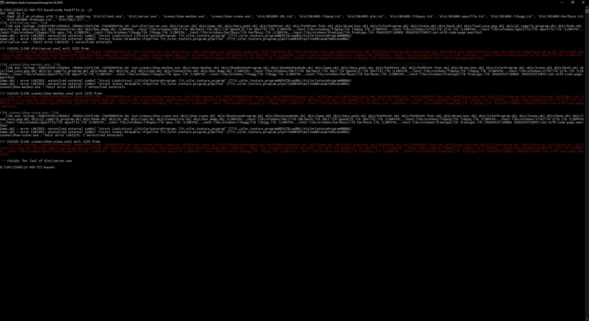

# Multiplayer PACMAN

Author: jingguol

Design: It's PACMAN for multiplayer

Networking: This game is supposed to be made in 3D. The bulk of communication is on the transformations of objects in the scene, including players. The server just update and tries to send all the transformations to clients.

I could not finally get the game up and running. As the base code is in 2D, I spent quite a lot of effort on migrating 3D stuff from previous games onto this one and trying to combine it with networking. I am stuck on a linking error, whose screenshot is below.

Screen Shot:

How To Play:

(TODO: describe the controls and (if needed) goals/strategy.)

Sources: Assets are created by myself

This game was built with [NEST](NEST.md).
